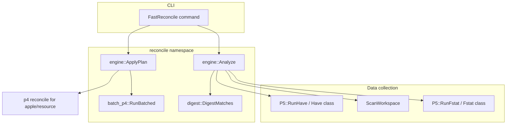

# Fast reconcile (`p5 fast-rec`)

## Problem

`p4 reconcile` (and P4V “Reconcile Offline Work”) compares the client workspace to the depot by issuing many per-file server operations. On large trees (tens or hundreds of thousands of files) this becomes slow; cost grows badly when many files differ.

`p5` keeps the normal `reconcile` / `rec` commands as **passthrough** to `p4`. **`fast-reconcile`** / **`fast-rec`** is a native implementation aimed at the same default offline-reconcile behavior, with an algorithm ported from [p4-fast-reconcile](https://github.com/brickadia/p4-fast-reconcile) (MIT).

## Goals

- Match default `p4 rec` results for add / edit / delete and “revert unchanged” style fixes on opened files.
- Support common flags: `-n`, `-c`, `-e`/`-a`/`-d`, `-m`, `-I`, and optional file paths.
- Stay compatible: exotic `reconcile` modes passthrough to `p4 reconcile` unchanged.
- Reuse existing `p5` connection, options (`-p`, `-u`, `-c`), and P4API tag protocol where appropriate.

## Architecture



High-level flow:

1. **Collect depot state** — one (or two) bulk `fstat -Rc -Ol` calls; refresh digests for `haveRev != headRev`.
2. **Scan workspace** — recursive filesystem walk under CWD; filter with `p4 ignores -i` unless `-I`.
3. **Optional have map** — when `-m` is set, `p4 have` provides `syncTime` per path to skip digest work.
4. **Classify** — two-phase analysis into action buckets (add, edit, delete, revert, reopen variants).
5. **Digest** — MD5 only for ambiguous files; compare with `DigestMatches()` (binary first, then text/utf8 rules).
6. **Apply** — batched `add`, `edit`, `delete -k`, `revert -k` via `P5::Run`, or preview lines in `-n` mode.

## Source layout

| Path | Role |
|------|------|
| [`include/p5/commands/fast_reconcile.h`](../../include/p5/commands/fast_reconcile.h) | CLI11 subcommand `fast-reconcile` / `fast-rec` |
| [`source/commands/fast_reconcile.cpp`](../../source/commands/fast_reconcile.cpp) | Flag parsing, passthrough detection, orchestration |
| [`include/p5/commands/fstat.h`](../../include/p5/commands/fstat.h) | Tag `fstat` collector (`Fstat` extends `Result`) |
| [`source/commands/fstat.cpp`](../../source/commands/fstat.cpp) | `Fstat::OutputStat`, `Fstat::Load` (bulk + stale-rev refresh) |
| [`include/p5/commands/have.h`](../../include/p5/commands/have.h) | Tag `have` collector (`Have` extends `Result`) |
| [`source/commands/have.cpp`](../../source/commands/have.cpp) | `Have::OutputStat`, `Have::Load` |
| [`include/p5/types.h`](../../include/p5/types.h) | Umbrella include for shared `p5` types |
| [`include/p5/types/depot.h`](../../include/p5/types/depot.h) | P4 enums, `DepotFileRecord`, `DepotState` |
| [`include/p5/types/have.h`](../../include/p5/types/have.h) | `HaveRecord` |
| [`include/p5/types/workspace.h`](../../include/p5/types/workspace.h) | Workspace scan and digest cache types |
| [`include/p5/types/reconcile.h`](../../include/p5/types/reconcile.h) | `ReconcilePlan`, `ReconcileOptions` |
| [`source/types/depot.cpp`](../../source/types/depot.cpp) | P4 action/type parsing, depot maps |
| [`source/types/workspace.cpp`](../../source/types/workspace.cpp) | Workspace file maps |
| [`include/p5/reconcile/engine.h`](../../include/p5/reconcile/engine.h) | `Analyze`, `ApplyPlan` |
| [`source/reconcile/engine.cpp`](../../source/reconcile/engine.cpp) | Classification, preview output, apply |
| [`include/p5/reconcile/digest.h`](../../include/p5/reconcile/digest.h) | MD5, cache, `DigestMatches` |
| [`source/reconcile/digest.cpp`](../../source/reconcile/digest.cpp) | OpenSSL MD5, `~/.cache/p5/digests_<client>.bin` |
| [`include/p5/reconcile/workspace_scan.h`](../../include/p5/reconcile/workspace_scan.h) | Local directory walk + ignores |
| [`source/reconcile/workspace_scan.cpp`](../../source/reconcile/workspace_scan.cpp) | `std::filesystem` walk; `p4 ignores -i` via subprocess |
| [`include/p5/reconcile/batch_p4.h`](../../include/p5/reconcile/batch_p4.h) | Split large file argument lists |
| [`source/reconcile/batch_p4.cpp`](../../source/reconcile/batch_p4.cpp) | Windows ~32k argv limit aware batching |

User-facing command reference: [`docs/p4/commands/fast-reconcile.md`](../p4/commands/fast-reconcile.md).

## P5 integration

Dedicated runners (same pattern as `RunChanges` / `RunClients`):

```cpp
Fstat P5::RunFstat(const std::vector<std::string> &args);
Have  P5::RunHave(const std::vector<std::string> &args);
```

Both enable tag protocol, call the private `Run<T>` template (retries, connection refresh), and return collector objects.

`Fstat::Load` / `Have::Load` are static helpers used by `reconcile::Analyze`.

## Analysis (action buckets)

Aligned with [p4-fast-reconcile](https://github.com/brickadia/p4-fast-reconcile#features):

| Bucket | Meaning |
|--------|---------|
| `doAdd` | In workspace, not in depot (or deleted at head), not opened for add |
| `doEdit` | Changed from have rev, not opened for edit |
| `doReopenEdit` | Changed, but opened for delete |
| `doDelete` | Missing from workspace, not opened for delete |
| `doReopenDelete` | Missing, but opened for edit |
| `doRevertAdd` | Opened for add, file gone from workspace |
| `doRevertEdit` | Opened for edit, content matches have |
| `doRevertDelete` | Opened for delete, content matches have |

**Phase 1** walks depot `fstat` records vs workspace presence and open `action`.

**Phase 2** walks workspace files vs depot map (respecting `filtered` / ignores).

**Digest phase** resolves “maybe” buckets using `fstat` `digest` and local MD5.

**`-m`**: if file mtime (seconds) is within 1s of `have` `syncTime`, skip digest for that candidate.

## Digest rules

- **Binary**: raw file MD5 (matches Perforce `fstat` digest for many types on Linux).
- **Text / unicode**: line-oriented normalization (CRLF stripped before `\n`).
- **Utf8 / utf16 / symlink**: utf8-style line normalization where applicable.
- **`DigestMatches`**: try binary digest first; if head type suggests text rules, try those too (fixes false positives on `unicode` files whose server digest is binary MD5 of local bytes).
- **Apple / resource**: not supported locally; paths collected in `unsupportedDepotFiles` and passed to `p4 reconcile` (with `-n` when previewing).

## P4IGNORE

`ScanWorkspace` runs `p4 ignores -i` in batches through a **separate shell subprocess** (not tag protocol), with `-p`/`-u`/`-c` from `g_options`, because tag mode does not deliver human-readable `path ignored` lines. Skipped when `-I` is set.

## Apply and output

- **Preview (`-n`)**: prints `//depot/path#rev - opened for …` (uses `p4 where` for paths without a depot `fstat` row, e.g. new adds).
- **Apply**: `RunBatched` for `add`, `edit`, `delete -k`, and `revert -k` sequences; `-c change#` on opens when set.
- **Reopen** sequences match the reference tool: `revert -k` then `edit`, or `revert -k` then `delete -k`.

## CLI and passthrough

Registered in [`source/main.cpp`](../../source/main.cpp) and [`source/utils/command_policy.cpp`](../../source/utils/command_policy.cpp) (`fast-rec` → `fast-reconcile` alias).

If any of these appear in arguments, the command forwards to `p4 reconcile` unchanged:

`-w`, `-k`, `-K`, `-M`, `-t`, `-f`, `-l`, `-L`, `-s`, `-A`, `--parallel=…`

## Build dependencies

[`CMakeLists.txt`](../../CMakeLists.txt) adds:

- `find_package(OpenSSL REQUIRED)`
- `OpenSSL::Crypto` on the `p5` target (for MD5 in `digest.cpp`)

P4API is still the primary link; OpenSSL is explicit because digest code calls it directly.

## Known limitations

- No `-M` move/add/delete pairing (same as p4-fast-reconcile).
- Passthrough required for `-w` (clean), `-k` (flush have), type-only reconcile `-t`, etc.
- Ignore detection depends on `p4` in `PATH` for the subprocess (same env as the user’s normal `p4`).
- Digest cache is per-client under `~/.cache/p5/`; delete the file to force a full rescan.

## Validation

Example workspace test:

```sh
cmake --workflow default
export P4CLIENT=your_client
cd /path/to/workspace

./build/Debug/p5 fast-rec -n | sort
./build/Debug/p5 rec -n 2>/dev/null | grep -E 'opened for|reverted' | sort
# Action lines should match when the tree has the same pending work.
```

Use a dedicated changelist before applying:

```sh
./build/Debug/p5 fast-rec -c <change#>
p4 opened -c <change#>
```

## Future work

- Optional `P5_FAST_REC=1` to route `rec` → `fast-rec` (see [TODO.md](../../TODO.md)).
- Restore parallel digest workers in `processDigest` (currently sequential `DigestMatches` for simplicity).
- Tag-protocol `ignores -i` if P4API exposes ignore results without a subprocess.

## Credit

Algorithm and behavior reference: [Brickadia/p4-fast-reconcile](https://github.com/brickadia/p4-fast-reconcile).
